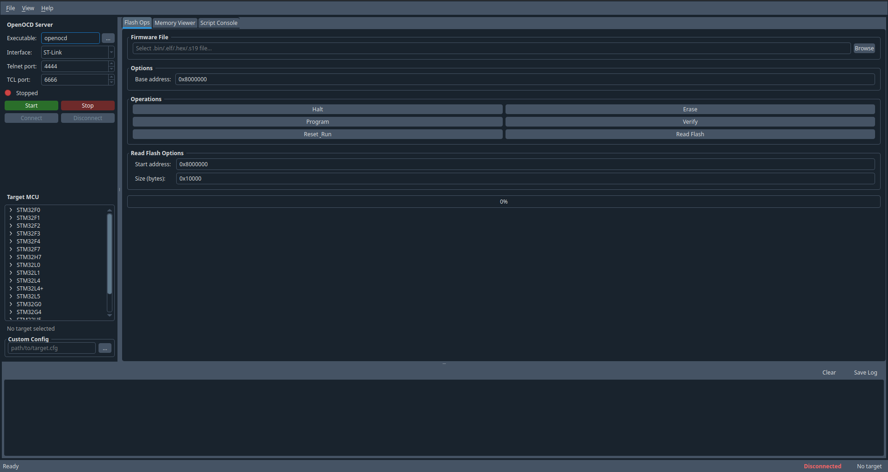
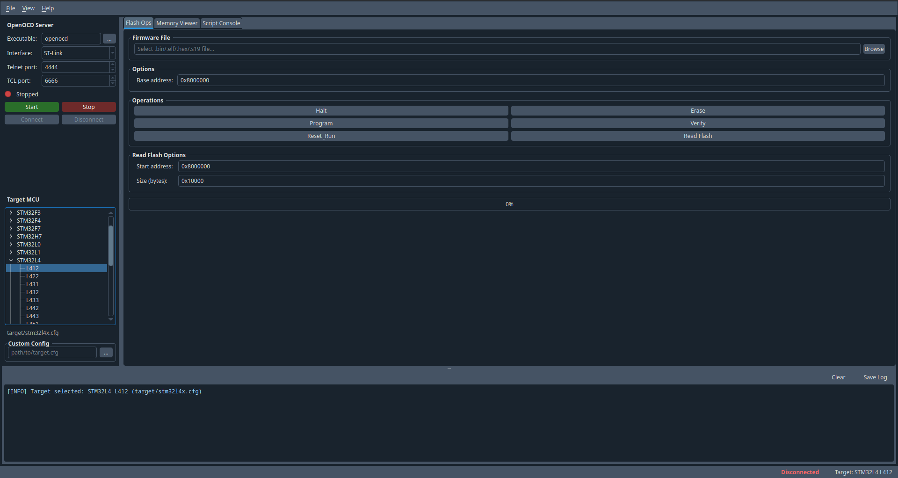
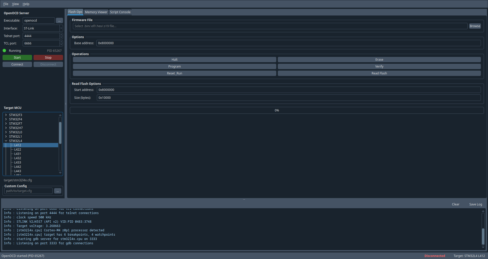
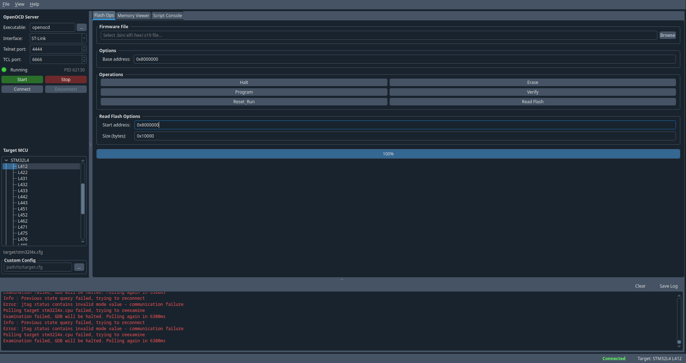
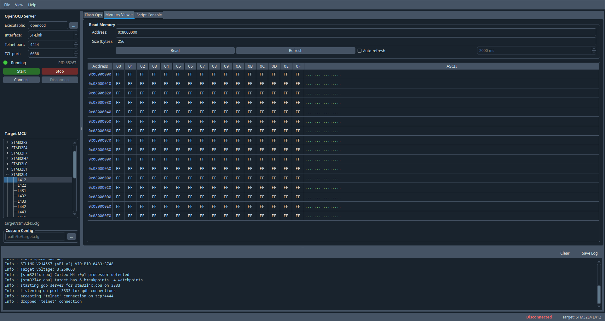
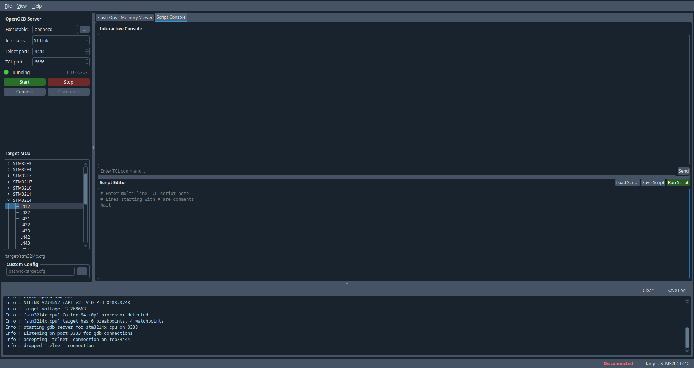

# OpenOCD Qt GUI

[](LICENSE)
[](https://www.python.org/)
[](https://pypi.org/project/PyQt5/)
[](https://openocd.org/)
[](https://github.com/ColinDuquesnoy/QDarkStyleSheet)
[](https://github.com/zissis-pap/openocd-qt-gui)
[](https://www.st.com/en/microcontrollers-microprocessors/stm32-32-bit-arm-cortex-mcus.html)
[](CHANGELOG.md)

A **PyQt5 graphical frontend** for the [OpenOCD](https://openocd.org/) on-chip debugger.
It lets you start/stop the OpenOCD server, flash firmware, inspect memory, and run
TCL scripts — all without touching a terminal.

> OpenOCD must be installed on your system separately. This tool is a GUI wrapper only.



---

## Features

| Feature | Description |
|---|---|
| **Server control** | Launch and terminate the OpenOCD subprocess from the GUI; detects an already-running instance on startup and allows stopping or disconnecting from it |
| **MCU selector** | Built-in tree for all major STM32 families; custom `.cfg` also supported |
| **Flash operations** | Halt · Erase · Program · Verify · Reset & Run · Read (dump) flash |
| **Memory viewer** | Live hex dump with flash-safe inline write-back, optional auto-refresh, one-click whole-flash read, and progress bar during reads |
| **Verify tab** | Side-by-side byte comparison of flash vs firmware; green/amber cell colouring |
| **Content Editor** | Named variable table; read-modify-erase-write individual flash variables; displays current flash values with ASCII preview; save/load variable sets to file |
| **Script console** | Interactive TCL prompt with command history + multi-line script editor |
| **Live log** | Scrollable, colour-coded output panel; exportable to file |
| **Dark theme** | Automatic via `qdarkstyle`; graceful fallback palette if not installed |

### Supported STM32 families

STM32F0, F1, F2, F3, F4, F7, H7, L0, L1, L4, L4+, L5, G0, G4, U5, WB, WL

### Supported debug interfaces

ST-Link, ST-Link v2, ST-Link v2-1, J-Link, CMSIS-DAP, FTDI

---

## Requirements

| Dependency | Version | Link |
|---|---|---|
| [Python](https://www.python.org/) | 3.8 + | https://www.python.org/downloads/ |
| [PyQt5](https://pypi.org/project/PyQt5/) | 5.12 + | https://pypi.org/project/PyQt5/ |
| [OpenOCD](https://openocd.org/) | 0.11 + (system package) | https://openocd.org/ |
| [qdarkstyle](https://github.com/ColinDuquesnoy/QDarkStyleSheet) *(optional)* | 3.x | https://github.com/ColinDuquesnoy/QDarkStyleSheet |

---

## Installation

### 1 — Install OpenOCD

**Debian / Ubuntu / Raspberry Pi OS**
```bash
sudo apt install openocd
```

**Arch Linux**
```bash
sudo pacman -S openocd
```

**Fedora**
```bash
sudo dnf install openocd
```

**macOS (Homebrew)**
```bash
brew install open-ocd
```

Verify the installation:
```bash
openocd --version
```

---

### 2 — Clone the repository

```bash
git clone https://github.com/zissis-pap/openocd-qt-gui.git
cd openocd-qt-gui
```

---

### 3 — Install Python dependencies

```bash
pip install PyQt5
pip install qdarkstyle        # optional but recommended
```

Or use a virtual environment:
```bash
python -m venv .venv
source .venv/bin/activate     # Windows: .venv\Scripts\activate
pip install PyQt5 qdarkstyle
```

---

### 4 — Install the pre-commit hook (optional, for contributors)

After a fresh clone, copy the hook to activate auto-versioning on commit:

```bash
cp hooks/pre-commit .git/hooks/pre-commit
chmod +x .git/hooks/pre-commit
```

---

### 5 — Run

```bash
python main.py
```

---

## Usage walkthrough

### Step 1 — Configure the server (left panel)

| Field | Description |
|---|---|
| **Executable** | Path to `openocd`. If it is on your `PATH`, leave it as `openocd`. Use `...` to browse to a custom binary. |
| **Interface** | The debug adapter connected to your PC (e.g. `ST-Link`). |
| **Telnet port** | Port OpenOCD listens on for commands (default `4444`). |
| **TCL port** | Port for the TCL server (default `6666`). |

### Step 2 — Select the target MCU

Expand the **Target MCU** tree on the left and click the family or specific part number
(e.g. `STM32L4 → L412`).

The matching OpenOCD config path (`target/stm32l4x.cfg`) is shown below the tree and
is passed to the server automatically on start.

For a board not in the list, type or browse to a custom `.cfg` file in the
**Custom Config** box.



### Step 3 — Start the server (or skip if already running)

Click **Start**. The status dot turns green and the PID is shown.
OpenOCD output appears immediately in the **log panel** at the bottom.

> **Startup detection:** if OpenOCD is already running when the app launches, it is
> detected automatically within 300 ms. The status dot turns **amber** ("Running
> externally"), the **Connect** button is enabled without needing to click Start,
> and the **Stop** button is enabled to shut down the external instance.
>
> - **Stop** — sends a `shutdown` command via the telnet interface (using the active
>   connection if already connected, or a temporary one otherwise) and resets the UI.
> - **Disconnect** — closes the telnet session without stopping the OpenOCD process.

### Step 4 — Connect

Click **Connect** to open a telnet session on the configured port.
The status bar changes from *Disconnected* (red) to *Connected* (green).
The Flash Ops, Memory Viewer, Content Editor, and Script Console tabs are now active.



---

### Flash Ops tab

1. Click **Browse** (or use *File → Open Firmware…*) to select your firmware.
   Supported formats: `.bin`, `.elf`, `.hex`, `.s19`.
2. Set the **Base address** if needed (default `0x08000000` for STM32).
3. Use the operation buttons:

| Button | What it does |
|---|---|
| **Halt** | Halts the CPU (`halt`) |
| **Erase** | Halts then erases flash from the base address |
| **Program** | Halts then programs and verifies the selected file |
| **Verify** | Opens the **Verify tab** with a byte-level comparison of flash vs the selected file |
| **Reset & Run** | Issues `reset run` to restart and execute firmware |
| **Read Flash** | Halts, prompts for a save path, then dumps flash to a `.bin` file |

A progress bar tracks multi-step operations. All output is forwarded to the log panel.



---

### Memory Viewer tab

1. Enter a **hex or decimal address** (e.g. `0x20000000` for SRAM).
2. Enter the number of **bytes** to read (e.g. `256`).
3. Click **Read** (or **Refresh** to re-read the same region).

Alternatively, click **Read Whole Flash** to let the tool detect the flash bank
geometry automatically. It sends `flash info 0` to OpenOCD, parses the bank base
address and total size from the sector list, fills in the address and size fields,
and starts the read. The detected geometry (base address and size in KB) is reported
in the log panel.

A **progress bar** appears below the controls while any read is in progress and
disappears automatically when the table is fully populated. On large MCUs (e.g. 2 MB
flash) this gives continuous feedback as data arrives in 256-byte chunks.

The table displays:
- **Address** column (blue) — start address of each row.
- **16 byte columns** — editable hex values. Changing a cell writes the byte back
  to the target immediately using a path appropriate for the address:
  - **Flash addresses** (`≥ 0x08000000`): the viewer halts the core, queries
    `flash info 0` to find the containing sector, reads back the full sector,
    patches the single byte, erases the sector, then programs it from a temporary
    binary — so the surrounding flash content is preserved.
  - **RAM addresses**: a fast `mww` (write word) is used directly.
- **ASCII** column (green) — printable characters; `.` for non-printable bytes.

Enable **Auto-refresh** and set an interval (minimum 500 ms) to continuously poll
the memory region — useful for watching live register or variable values.



---

### Verify tab

The Verify tab gives a byte-level, side-by-side comparison of what is in flash versus
what is in a firmware file.

**Launching a verification:**

1. In the **Flash Ops** tab, select your firmware file and set the base address.
2. Click **Verify**. The application switches to the Verify tab automatically and
   begins reading flash over the telnet connection.

**Reading the table:**

The table has 35 columns:

| Column(s) | Content |
|---|---|
| **Address** | Start address of the row (blue) |
| **F00 – F0F** | Flash bytes read from the device |
| **Flash ASCII** | Printable representation of flash bytes (green) |
| **B00 – B0F** | Corresponding bytes from the firmware file |
| **File ASCII** | Printable representation of file bytes (green) |

Every byte cell is colour-coded:

- **Green** — flash byte matches the file byte.
- **Amber** — flash byte differs from the file byte.

A summary label above the table shows:

```
firmware.bin vs 0x08000000 — 65536 bytes | 65536 match  0 differ
```

A progress bar is visible while flash is being read and hides when the table is
populated.

> You can also navigate to the Verify tab at any time and trigger a new comparison
> by going back to Flash Ops and clicking **Verify** again.

---

### Content Editor tab

The Content Editor lets you define named flash variables and write them individually
without re-flashing the entire firmware image.

#### Defining variables

Each row in the table represents one variable:

| Column | Description |
|---|---|
| **Address** | Flash address in hex (e.g. `0x08001000`) |
| **Name** | Human-readable label |
| **Size (bytes)** | Number of bytes the variable occupies |
| **Data (hex)** | Value to write — see accepted formats below |
| **Current Value** | Value currently stored in flash (read-only; refreshed on demand) |

**Accepted data formats:**

| Input | Interpretation |
|---|---|
| `0xDEADBEEF` | Integer literal, stored little-endian |
| `3000` | Decimal integer, stored little-endian |
| `DE AD BE EF` | Space-separated hex bytes, stored in order |
| `DEADBEEF` | Continuous hex string, stored in order |

For string variables, enter the bytes as space-separated hex (e.g. `48 65 6C 6C 6F 00`).

#### Reading current values

Click **Read Values** to read every variable's current content from flash.
The **Current Value** column shows:
- A decimal number for values ≤ 65 535
- A hex number for larger numeric values
- A quoted ASCII string for variables > 4 bytes (e.g. `"Hello."`)
- A space-separated hex dump when no bytes are printable

#### Writing to flash

Click **Store** to perform a read-modify-erase-write cycle for all variables:

1. The target is halted.
2. All flash sectors touched by the variable list are identified.
3. Each sector is read back in full, the new variable bytes are patched in, the sector is erased, and the modified image is written back.
4. Current values are refreshed automatically when the operation completes.

Multiple variables in the same sector are batched into a single erase/write cycle.

#### Saving and loading variable sets

- **Save Set…** — exports the current table to a `.varset` (JSON) file.
- **Load Set…** — imports a previously saved `.varset` file and populates the table.

The file format is plain JSON and can be edited by hand:

```json
[
  {"address": "0x08001000", "name": "device_id",  "size": "4",  "data": "0x00000001"},
  {"address": "0x08001004", "name": "timeout_ms", "size": "2",  "data": "1000"},
  {"address": "0x08001010", "name": "label",      "size": "16", "data": "48 65 6C 6C 6F 00 00 00 00 00 00 00 00 00 00 00"}
]
```

---

### Script Console tab

#### Interactive console (top half)

- Type any OpenOCD/TCL command in the input field and press **Enter** or click **Send**.
- Use the **↑ / ↓ arrow keys** to navigate through the last 100 commands.
- Output is colour-coded: commands in blue, errors in red, normal output in light grey.

#### Script editor (bottom half)

- Write or paste a multi-line TCL script. Lines beginning with `#` are treated as
  comments and skipped.
- **Load Script** — open an existing `.tcl` file.
- **Save Script** — save the current editor content to a `.tcl` file.
- **Run Script** — execute all non-comment lines sequentially; output appears in the
  console above.

Example script (erase, flash, and run):
```tcl
# Full flash cycle
halt
flash erase_address pad 0x08000000 0x20000
program /path/to/firmware.bin 0x08000000 verify
reset run
```



---

### Log panel

The log panel at the bottom captures all output:

- OpenOCD stdout/stderr is streamed in real time.
- Responses to commands from Flash Ops, Memory Viewer, and Script Console are
  appended here as well.
- **Clear** removes all entries.
- **Save Log** exports the full log to a text file.

---

## Project structure

```
openocd-qt-gui/
├── main.py               Entry point; initialises the Qt application
├── mainwindow.py         Main window layout and signal wiring
├── openocd_manager.py    Subprocess lifecycle (start / stop / stdout capture)
├── openocd_client.py     Telnet client (async + synchronous variants)
├── mcu_config.py         STM32 family definitions and interface configs
└── widgets/
    ├── server_control.py  Server configuration and start/stop/connect buttons
    ├── mcu_selector.py    MCU family tree + custom config input
    ├── flash_ops.py       Flash operations tab
    ├── memory_viewer.py   Hex memory viewer/editor tab (flash-safe writes)
    ├── verify_widget.py   Side-by-side flash vs firmware comparison tab
    ├── content_editor.py  Named variable editor tab (read-modify-erase-write)
    ├── script_console.py  Interactive TCL console + script editor tab
    └── log_widget.py      Scrollable log output panel
```

---

## Troubleshooting

**`OpenOCD executable not found`**
Ensure `openocd` is on your `PATH` (`which openocd`) or provide the full path in the
*Executable* field.

**`Cannot connect to OpenOCD at localhost:4444`**
The server must be fully started and listening before you click **Connect**. Watch the
log panel — OpenOCD prints `Listening on port 4444 for telnet connections` when ready.

**Permission denied on the debug adapter (Linux)**
Add a udev rule for your adapter, e.g. for ST-Link:
```bash
sudo cp /usr/share/openocd/contrib/60-openocd.rules /etc/udev/rules.d/
sudo udevadm control --reload-rules
sudo udevadm trigger
```
Then re-plug the adapter and add your user to the `plugdev` group:
```bash
sudo usermod -aG plugdev $USER
```

**Communication errors / polling failures in the log**
These are usually OpenOCD polling the target while it is running. They are harmless and
will stop once you click **Halt**.

---

## License

This project is licensed under the **GNU General Public License v3.0**.
See the [LICENSE](LICENSE) file for the full text.
